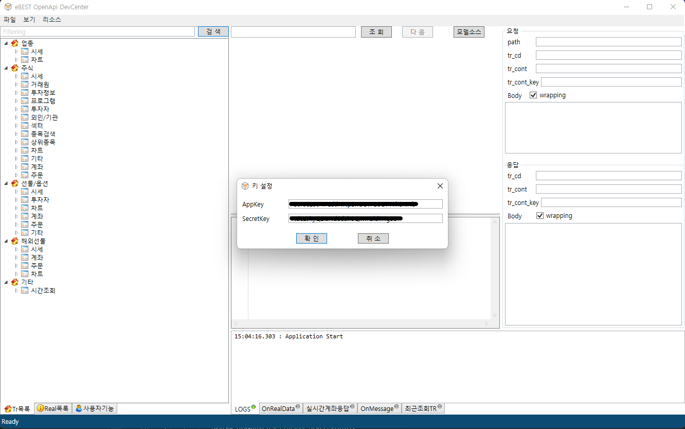
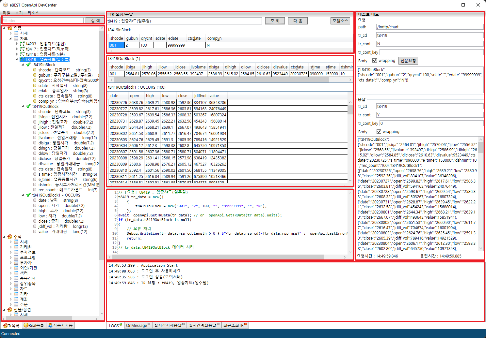
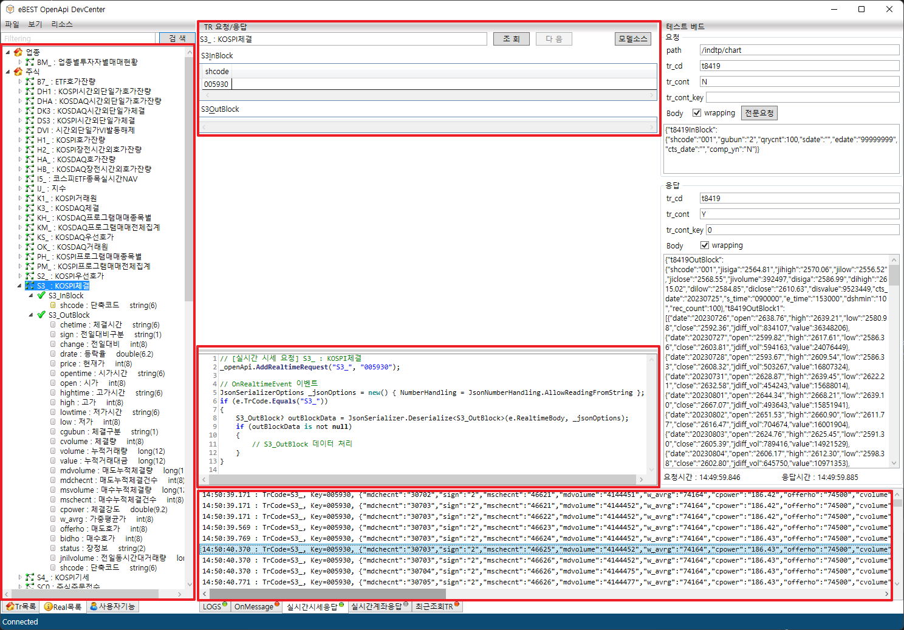
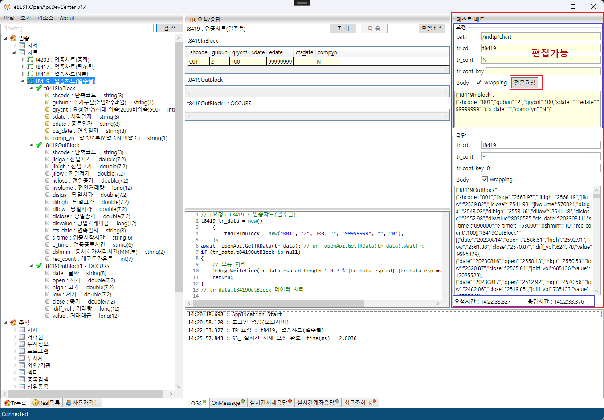

# eBEST.OpenApi.DevCenter

eBEST OpenApi 개발/테스트 프로젝트.

## 개발환경
Visual Studio 2022, NET8.0

## 설치
 
[릴리즈 버젼](https://github.com/teranum/eBEST.OpenApi.DevCenter/releases)
/releases

## 사용법

### XingApi DevCenter 와 작동법 거의 일치.
 
### 로그인, 모든 TR요청, 실시간시세요청, 실시간 시세 수신 등의 기능을 테스트 할 수 있음.

### 간편 검색기능, 모델 소스 생성 기능 제공

## 📷 Screenshots
* 이베스트 OpenApi 로그인 기능

* TR목록 + 입력설정 + 출력데이터 표시 + TR요청 소스 및 모델소스 표시 + JSON 요청/응답 데이터 표시 + 애플리케이션 로그 표시

* 실시간목록 + 요청 및 실시간 시세 수신

